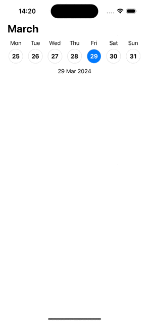

# SwiftUI Week View Calendar

## Overview

This is a simple SwiftUI calendar component that displays a week view similar to the native iOS calendar. It automatically selects today's date and ensures that the same day of the week remains selected as you scroll through weeks in the calendar.

## Features

- Week view calendar display
- Automatic selection of today's date
- Automatic selection of the same day of the week while scrolling
